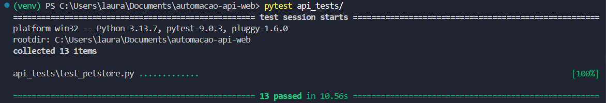
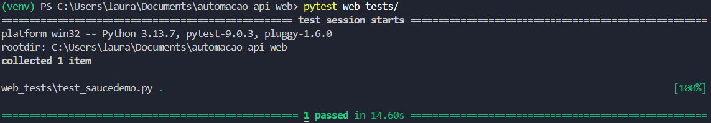
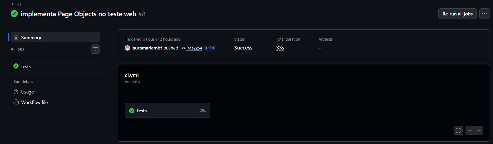
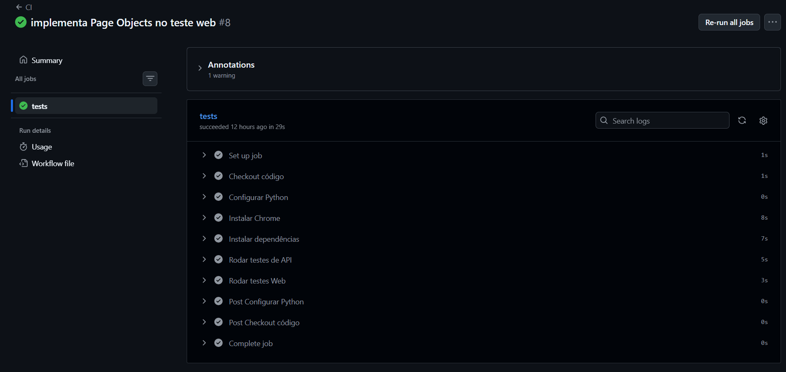

# Automação de Testes - API e Web

Projeto de automação de testes cobrindo API REST e interface web, com pipeline de CI integrada via GitHub Actions.

## Tecnologias

- Python 3.13
- pytest
- requests
- Selenium
- WebDriver Manager

## Estrutura do Projeto

```
automacao-api-web/
├── api_tests/
│   ├── config.py
│   └── test_petstore.py
├── web_tests/
│   ├── config.py
│   ├── pages/
│   │   ├── login_page.py
│   │   ├── inventory_page.py
│   │   └── checkout_page.py
│   └── test_saucedemo.py
└── .github/
└── workflows/
└── ci.yml
```
## Como Executar

### 1. Clone o repositório
```bash
git clone https://github.com/lauramariambt/automacao-api-web.git
cd automacao-api-web
```

### 2. Crie e ative o ambiente virtual
```bash
python -m venv venv
.\venv\Scripts\Activate.ps1  # Windows
```

### 3. Instale as dependências
```bash
pip install pytest requests selenium webdriver-manager
```

### 4. Execute os testes

**API:**
```bash
pytest api_tests/
```

**Web:**
```bash
pytest web_tests/
```

## Testes de API - Petstore

- `POST /pet` — cadastra um pet
- `GET /pet/{id}` — busca pet por ID
- `PUT /pet` — atualiza pet
- `DELETE /pet/{id}` — remove pet
- `GET /pet/findByStatus` — lista pets por status
- `POST /store/order` — cria pedido
- `GET /store/order/{id}` — busca pedido
- `DELETE /store/order/{id}` — cancela pedido
- `GET /store/inventory` — consulta inventário
- `POST /user` — cria usuário
- `GET /user/{username}` — busca usuário
- `PUT /user/{username}` — atualiza usuário
- `DELETE /user/{username}` — remove usuário

## Teste Web - SauceDemo

Fluxo E2E completo utilizando Page Objects:
1. Login com usuário válido
2. Adição de produto ao carrinho
3. Acesso ao carrinho e validação do item
4. Preenchimento dos dados de entrega
5. Finalização da compra
6. Validação da página de confirmação

## CI/CD

O pipeline executa automaticamente a cada push, rodando todos os testes de API e Web no GitHub Actions.

## Prints

### Testes locais - API


### Testes locais - Web


### GitHub Actions


